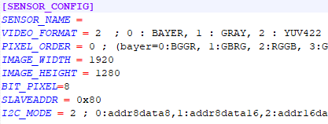

# CameraMaster

**CameraMaster User Manual**

The CameraMaster (software GUI) interacts directly with the MIG-S2 Grabber to control camera modules, configure serializers/deserializers, and capture image in real-time.

**Table of Contents**

1.  System Overview
2.  Configuration File Structure
    -   2.1 Grabber Configuration
    -   2.2 Power Configuration
    -   2.3 Deserializer Configuration
    -   2.4 Serializer Configuration
    -   2.5 Image Sensor / ISP Configuration
3.  Module Bring-up Procedure
    -   3.1 Required Information
    -   3.2 Bring-up Test Using CameraMaster
4.  Offline Test Mode
    -   4.1 Test Procedure
5.  Additional Menu Functions
6.  Grabber Terminal Usage
    -   6.1 Setting I2C Address
    -   6.2 Writing I2C Data
    -   6.3 Reading I2C Data
7.  Image Kit Content
    -   SFR
    -   Distortion
    -   Defect
    -   Stain (Blemish)
    -   Optical Center
    -   Shading (Vignetting)
    -   Fixed Pattern Noise
    -   Uniformity
8.  Driver Installation
9.  Appendix & Notes

**1. System Overview**

CameraMaster operates through a following data flow.

-   **Configuration Data Flow (for settings):**  
    CameraMaster(PC USB) → S2 Board (I2C) → Deserializer (GMSL) → FAKRA Cable → Serializer (I2C) → Camera Module (I2C)
-   **Video Signal Flow (for image data):**  
    Camera Module (MIPI) → Serializer (GMSL) → FAKRA Cable → Deserializer (MIPI) → S2 Board(USB) → CameraMaster(PC)

**2. Configuration File Structure**

CameraMaster utilizes .ini files to configure sensor modules.

**2.1 Grabber Configuration**

-   Image Format
-   Image Size
-   Default i2c format
-   Etc.

**2.2 Power Configuration**

-   Module Power Configuration

    

**2.3 Deserializer Configuration**

-   GMSL Link Speed Configuration
-   Output MIPI Lane Configuration
-   Etc.

    

**2.4 Serializer Configuration**

-   GMSL Link Speed Configuration
-   Input data type Configuration
-   Output GPIO Configuration
-   Etc.

    

**2.5 Image Sensor / ISP Configuration**

-   Initial register settings for streaming.
-   Etc.

    

**3. Module Bring-up Procedure**

**3.1 Required Information**

**case 1. Image Sensor and SER initial is downloaded during module boot up**

**case 2. Image Sensor and SER initial is setup by host i2c command**

| **Required Information**         | **case 1 (boot)** | **case 2 (host)** |
|----------------------------------|-------------------|-------------------|
| **Image Format**                 | **O**             | **O**             |
| **Image Resolution**             | **O**             | **O**             |
| **Image Sensor initial setting** | **X**             | **O**             |
| **Serializer setting**           | **X**             | **O**             |
| **De-serializer setting**        | **O**             | **O**             |
| **PoC Power Voltage**            | **O**             | **O**             |

1.  **Bring-up Test Using CameraMaster**
2.  Select configuration file
3.  View configuration file contents
4.  Power ON camera module
5.  View live video
6.  Initialize sensor
7.  Power OFF
8.  Currently selected configuration file name
9.  Monitor frame status
10. Monitor Grabber board connection
11. Monitor I2C logs

**4. Offline Test Mode**

**4.1 Test Procedure**

1.  Select configuration(ini) file
2.  Load image file
3.  Save image file
4.  Open ini in Notepad
5.  Open Inspection Option window
6.  Set Offline test mode (test without capturing)
7.  Proceed Test item.
8.  Open the Inspection Options Settings window for the corresponding item.

**5. Additional Menu Functions**

1.  Open report directory
2.  Open settings path
3.  Open item option file
4.  Access program folder

**6. Grabber Terminal Usage**

**6.1 Setting I2C Address**

devadr x90 400 1 1

// Slave Address: x90

// I2C Speed: 400kHz

// 16-bit Register Address: Enabled

// 16-bit Register Data: Enabled

**6.2 Writing I2C Data**

x0000 x90

// Write value x90 to register x0000

**6.3 Reading I2C Data**

i2cr x0000

// Read 1 byte from x0000

i2cr x0000 4

// Read 4 bytes from x0000

**7. Image Kit Content**

CameraMaster have a solution for camera module inspection.

-   SFR

      

    \- Tested according to ISO-12233:2023 standard

    \- Measuring resolution with chart image including edges

-   Distortion

    

\- Check the ratio of A and B using the SMIA standard inspection method

-   Defect

     

    \- This occurs when there is a defect in the sensor's pixels or foreign matter on the sensor surface.

    \- Perform tests in bright or dark environments

-   Stain (Blemish)

     

    \- Defects due to foreign matter such as dust on the lens or between the lens and the image sensor

-   Optical Center

    

    \- Determine the location of the brightest area in the image and check how far it deviates from the center of the image.

-   Shading (Vignetting)

    

    \- Test is conducted by comparing the difference in brightness between the central and peripheral areas.

-   Fixed Pattern Noise

     

    \- This occurs because the pixel characteristics of the image sensor are not completely uniform.

\- Perform tests in bright or dark environments

-   Uniformity

    

    \- Check the uniformity of the image by measuring the standard deviation of the image.

**8. Driver Installation**

Install the MIG_Driver_win10_x64 package:

**9. Appendix & Notes**

-   2025-06-23
    -   Initial release

**CIZEN TECH Co., Ltd.**

507, 8 Sanbon-ro 324beon-gil, Gunpo-si, Gyeonggi-do, Republic of Korea

contact@cizentech.com

http://cizentech.com/

Disclaimer and Copyright Notice

Information in this document, including URL references, is subject to change without notice.

No permission is granted to use for purpose anything but descriptions in this document. Disorderly binding and page missing shall be replaced into a correct documentation
