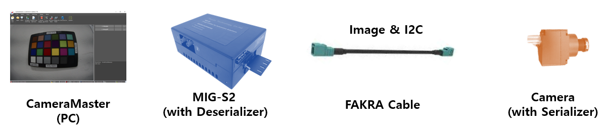

# CameraMaster

**CameraMaster User Manual**

The CameraMaster (software GUI) interacts directly with the MIG-S2 Grabber to control camera modules, configure serializers/deserializers, and capture image in real-time.

**Table of Contents**

1.  System Overview
2.  Configuration File Structure
    -   2.1 Grabber Configuration
    -   2.2 Power Configuration
    -   2.3 Deserializer Configuration
    -   2.4 Serializer Configuration
    -   2.5 Image Sensor / ISP Configuration
3.  Module Bring-up Procedure
    -   3.1 Required Information
    -   3.2 Bring-up Test Using CameraMaster
4.  Offline Test Mode
    -   4.1 Test Procedure
5.  Additional Menu Functions
6.  Grabber Terminal Usage
    -   6.1 Setting I2C Address
    -   6.2 Writing I2C Data
    -   6.3 Reading I2C Data
7.  Image Kit Content
    -   SFR
    -   Distortion
    -   Defect
    -   Stain (Blemish)
    -   Optical Center
    -   Shading (Vignetting)
    -   Fixed Pattern Noise
    -   Uniformity
8.  Driver Installation
9.  Appendix & Notes

## 1. System Overview

CameraMaster operates through a following data flow.

-   **Configuration Data Flow (for settings):**  
    CameraMaster(PC USB) → S2 Board (I2C) → Deserializer (GMSL) → FAKRA Cable → Serializer (I2C) → Camera Module (I2C)
-   **Video Signal Flow (for image data):**  
    Camera Module (MIPI) → Serializer (GMSL) → FAKRA Cable → Deserializer (MIPI) → S2 Board(USB) → CameraMaster(PC)

## 2. Configuration File Structure

CameraMaster utilizes .ini files to configure sensor modules.

**2.1 Grabber Configuration**

-   Image Format
-   Image Size
-   Default i2c format
-   Etc.

**2.2 Power Configuration**

-   Module Power Configuration

    

**2.3 Deserializer Configuration**

-   GMSL Link Speed Configuration
-   Output MIPI Lane Configuration
-   Etc.

    

**2.4 Serializer Configuration**

-   GMSL Link Speed Configuration
-   Input data type Configuration
-   Output GPIO Configuration
-   Etc.

    

**2.5 Image Sensor / ISP Configuration**

-   Initial register settings for streaming.
-   Etc.

    

## 3. Module Bring-up Procedure

**3.1 Required Information**

**case 1. Image Sensor and SER initial is downloaded during module boot up**

**case 2. Image Sensor and SER initial is setup by host i2c command**

| **Required Information**         | **case 1 (boot)** | **case 2 (host)** |
|----------------------------------|-------------------|-------------------|
| **Image Format**                 | **O**             | **O**             |
| **Image Resolution**             | **O**             | **O**             |
| **Image Sensor initial setting** | **X**             | **O**             |
| **Serializer setting**           | **X**             | **O**             |
| **De-serializer setting**        | **O**             | **O**             |
| **PoC Power Voltage**            | **O**             | **O**             |

**3.2 Bring-up Test Using CameraMaster**

1.  Select configuration file
2.  View configuration file contents
3.  Power ON camera module
4.  View live video
5.  Initialize sensor
6.  Power OFF
7.  Currently selected configuration file name
8.  Monitor frame status
9.  Monitor Grabber board connection

1.  Select Power On / Off
2.  Check Applied Voltage after Power On
3.  Check Current
4.  Select Sensor & SER & DES initial set
5.  Power Off when Sensor Init Fail
6.  Check Sensor PCLK and Horizontal and Vertical sync count

## 4. Offline Test Mode

**4.1 Test Procedure**

1.  Select configuration(ini) file
2.  Load image file
3.  Save image file
4.  Open ini in Notepad
5.  Open Inspection Option window
6.  Set Offline test mode (test without capturing)
7.  Proceed Test item.
8.  Open the Inspection Options Settings window for the corresponding item.

## 5. Additional Menu Functions

1.  Open report directory
2.  Open settings path
3.  Open item option file
4.  Access program folder

## 6. Grabber Terminal Usage

**6.1 Setting I2C Address**

devadr x90 400 1 1

// Slave Address: x90

// I2C Speed: 400kHz

// 16-bit Register Address: Enabled

// 16-bit Register Data: Enabled

**6.2 Writing I2C Data**

x0000 x90

// Write value x90 to register x0000

**6.3 Reading I2C Data**

i2cr x0000

// Read 1 byte from x0000

i2cr x0000 4

// Read 4 bytes from x0000

## 7. Grabber Terminal command list

VER (Read current F/W H/W version)

DEVADR x90 400 10 (SlaveAddr [Speed] [WordIndex(0/1)] [WordValue(0/1)]/ Change CAM_I2C slave address)

I2CR xAABB 1 (RegAddr, NumOfRead / Read CAM_I2C Register)

I2CW xAABB x12 (RegAddr, Value / Write CAM_I2C Register)

DELAY 100 (delay time 100 milisec)

I2C32W xaabbccdd x12 (I2C 32bit Address and 1byte data write)

I2C32R xaabbccdd (I2C 32bit Address and read 1byte data)

GPIOR 1 (Pin_1 / read Value(high:1,low:0) / Read GPIO)

GPIOW 1 0 (Pin_1 low / set Value(high: 1,low:0) / Write GPIO)

PWR 1 10 (Channel_1 = 10 V / Channel:1\~ (if Zero, OV Forcesing) / Power ON the specified channel)

PWROFF 1 (Channel_1 off / Channel:1\~ / Power OFF the specified channel. without Param, off all channel)

MEASUREV 1 10 (Channel(1\~), Average Count(10) / Measure voltage)

MEASUREC 1 10 (Channel(1\~), Average Count(10) / Measure current)

BOARD_PRESET RESET (RESET: reset (set this before sensor initial), ENABLE: enable (set this after sensor initial) - for S2 board internal)

FPS (check Frame Per Second)

CHECKSYNC (Check image data sync count)

MIPI_VIRTUAL_CH_SEL 0 (select virtual channel 0, 1,,)

DES_INDEX_SEL 1 (1,2,3,,8 (or TI)(select DES Channel) - This only works on certain daughterboards.

FSYNC_AUTO_SET 1 30 (Periodic Frame Sync 0:Disable 1:Eanble / 1:1Hz, 30:30 Hz)

FSYNC_SINGLE (Single Frame Sync. 1pulse generate.it should disable FSYNC_AUTO_SET)

MSGBOX test1 (Popup message box)

BULK_MODE_START (Bulk Mode data Starting) – in bulk mode, all data (start\~end) will send to board first, after each data will be send to target.

BULK_MODE_END (Bulk Mode data Finishing)

## 8. CameraMaster installation

[installation program](https://cizentech-my.sharepoint.com/:u:/p/mason/EZeax6VV-1VKriBgZKDfdEwBMlDYa9pkRP8T6u_6m8a5zQ?e=BvJcAH)

## 9. Driver Installation

[Install the MIG_Driver_win10_x64 package](https://cizentech-my.sharepoint.com/:u:/p/mason/Ed_I9q-3fPpAj6ca6SkHVgQBklY5Z7CpYuXBG8GC3qJv5g?e=32tdgL)

[Install the MIG_Driver_Signed_win10_x64 package](https://cizentech-my.sharepoint.com/:u:/p/mason/EVryLOTvBRBJhrQF8aKAbaQBKpjr-BKYtnMeJWi-xjI3uw?e=tfwECH)

## 10. Trouble shoot

Occurs when there is no ini file. Select the ini file.

Occurs when there is no user information. Enter the red box user information.

ini selection button disabled. Occurs when the user is not an Engineer. Select Engineer as the user.

Install “[Visual C++ Redistributable for Visual Studio 2015\~2022](https://cizentech-my.sharepoint.com/:u:/p/mason/EVMhVvG3-CtCtEEtHW4ev9wB4d4AobfjBobrFZFd4BxH6Q?e=UaIyb8)”

## 11. Appendix & Notes

-   2025-06-23
    -   Initial release

**CIZEN TECH Co., Ltd.**

624, 6F, 118 LS-ro 116beon-gil, Dongan-gu, Anyang-si, Gyeonggi-do, Republic of Korea

sw@cizentech.com

http://cizentech.com/

Disclaimer and Copyright Notice

Information in this document, including URL references, is subject to change without notice.

No permission is granted to use for purpose anything but descriptions in this document. Disorderly binding and page missing shall be replaced into a correct documentation
