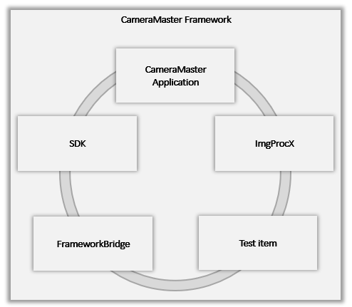

# CameraMaster Framework



## CameraMaster Application

\* Main executable application for image acquisition and inspection

\* Renders captured video streams in real-time

\* Executes test items for automated image analysis and validation

\* Generates inspection reports and logs based on test results

## ImgProcX library

\* High-performance image processing library

\* Provides functions for image format conversion (e.g., demosaicing raw Bayer images)

\* Optimized for parallel execution to enhance high-speed

\* Utilizes GPU acceleration for high-speed processing of large image data

## SDK library

\* Provides a API for control of the image grabber

\* Supports image sensor initialization, register configuration, and real-time image capture

## FrameworkBridge library

\* Core interface library for test item development

\* Defines standardized communication protocols between the application and test modules

\* Enables test item integration and lifecycle management within the main application

## Test Item

\* User-implementable inspection module based on ‘FrameworkBridge’

\* Acquires image data from the grabber for custom analysis

\* Performs algorithmic evaluation on captured frames (e.g., defect detection, measurement, etc.)

\* Communicates inspection results back to the main application for display and report generation

```
class FRAMEWORKBRIDGECLASS CInspectionItem
{
	friend class CInspectionItemImpl;
public:

	CInspectionItem(LPCTSTR lpszName,
	                MIG::INSPECTION_TYPE type,
	                MIG::INSPECTION_METHOD method,
	                int nParaNo,
	                int nBoardId);

	virtual ~CInspectionItem();

private:
	CInspectionItemImpl*    m_pInspectionItemImpl = nullptr;

protected:
	virtual BOOL    PreInitialize();

	virtual BOOL    PreInspect();

	virtual void    PostInspect();

	virtual BOOL    Inspect()   = 0;

	HWND    SetOptionDialog(HWND hWnd);
	HWND    SetResultDialog(HWND hWnd);

	void    SetInspectionMethod(MIG::INSPECTION_METHOD method);

public:
	BOOL    InitTest();
	BOOL    PreTest();
	void    PostTest();

	int     Test();

	BOOL    Abort(BOOL bResult, ULONG ulTimeout = 1000); // do not call in item. it could be deadlock.

	BOOL    IsAbort() const;

	BOOL    IsTesting() const;

	int     GetParaNo(void) const;
	void    SetParaNo(int nIndexParaNo);

	void    SetName(LPCTSTR lpszName);
	LPCTSTR GetName(void) const;

	MIG::INSPECTION_TYPE        GetInspectionType(void) const;
	MIG::INSPECTION_METHOD      GetInspectionMethod(void) const;

	LPCSYSTEMTIME   GetStartedTime() const;

	void    EnableInspection(BOOL bEnable = TRUE);
	BOOL    IsEnabled() const;

	virtual BOOL    SaveOptions();
	virtual BOOL    LoadOptions();

	const HWND  GetOptionDialog() const;
	const HWND  GetResultDialog() const;


	int     GetResultBinCode(void) const;
	LPCTSTR GetResultBinCodeName(void) const;
	void    SetResultBinCode(int nBinCode, LPCTSTR lpszName);

	int     GetBoardId(void) const;

	void    SetLiveItemCaptureTimeout(DWORD dwTimeout_ms);
};
```
