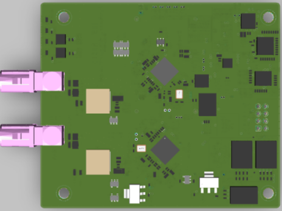

# Deserializer

**Deserializer (DES) boards for the MIG frame grabbers.** They recover the GMSL / FPD-Link signal from the camera-side serializer (SER) back into MIPI-CSI-2.

## What is GMSL?

**GMSL (Gigabit Multimedia Serial Link)** is an automotive SerDes (Serializer/Deserializer) technology. A camera-side **serializer (SER)** serializes video, control, and power into one signal carried over a **single coax or STP cable**, and a grabber-side **deserializer (DES)** recovers it back into MIPI-CSI-2 video.

Its control channel is bidirectional, so sensor, SER, and DES registers are configured over I2C on the same cable, and PoC (Power over Coax) even feeds power to the camera. A single cable reaches roughly 15 m, making it well suited to vehicle harnesses.

Link speeds by generation are **GMSL1 (up to ~3.12 Gbps)**, **GMSL2 (up to ~6 Gbps)**, and **GMSL3 (up to ~12 Gbps)**, with newer DES parts offering backward-compatible modes. TI's **FPD-Link III / IV** is the equivalent alternative SerDes family.

## Deserializers We Provide

-   **MAX9296A** — ADI (Maxim) GMSL2/GMSL1 dual-link deserializer. Shipped as the default DES board on the MIG frame grabbers.
-   **MAX96724** — ADI (Maxim) GMSL2/GMSL1 quad-link deserializer supporting up to 4-channel camera input.
-   **DS90UB954** — TI FPD-Link III deserializer supporting up to 2-channel camera input.
-   **DS90UB9702** — TI FPD-Link IV deserializer with backward-compatible FPD-Link III mode.

## Verified Combinations

| Maker | DES        | SER       | Type         |
|-------|------------|-----------|--------------|
| ADI   | MAX9296A   | MAX96717  | GMSL2        |
| ADI   | MAX9296A   | MAX9295D  | GMSL2        |
| ADI   | MAX9296A   | MAX96789F | GMSL2        |
| ADI   | MAX9296A   | MAX96717F | GMSL1        |
| ADI   | MAX9296A   | MAX9283   | GMSL1        |
| ADI   | MAX96724   | MAX96717  | GMSL2        |
| ADI   | MAX96724   | MAX96789F | GMSL2        |
| TI    | DS90UB954  | DS90UB953 | FPD-Link III |
| TI    | DS90UB9702 | DS90UB971 | FPD-Link IV  |

> The table lists combinations CIZEN TECH has verified in-house; many additional SER/DES combinations are also supported. Contact us for your specific camera / SerDes pairing.

## Selecting the Deserializer

Use the Grabber terminal to select which onboard deserializer is active:

-   `DES_INDEX_SEL 1` // select ADI (Maxim) deserializer
-   `DES_INDEX_SEL TI` // select TI deserializer

## Resources

-   [Ask about a combination](mailto:contact@cizentech.com) — contact@cizentech.com
