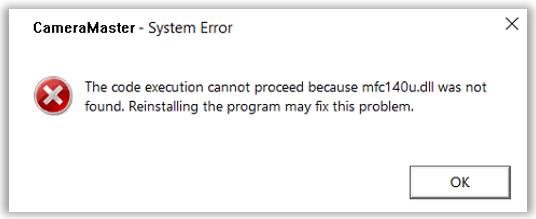

# Driver Installation

## Visual C++ Redistributable for Visual Studio 2015\~2022

Install “[Visual C++ Redistributable for Visual Studio 2015\~2022](https://cizentech-my.sharepoint.com/:u:/p/mason/EVMhVvG3-CtCtEEtHW4ev9wB4d4AobfjBobrFZFd4BxH6Q?e=UaIyb8)”

## MIG-S2 Driver Installation

[Install the MIG_Driver_win10_x64 package](https://cizentech-my.sharepoint.com/:u:/p/mason/Ed_I9q-3fPpAj6ca6SkHVgQBklY5Z7CpYuXBG8GC3qJv5g?e=32tdgL)

[Install the MIG_Driver_Signed_win10_x64 package](https://cizentech-my.sharepoint.com/:u:/p/mason/EVryLOTvBRBJhrQF8aKAbaQBKpjr-BKYtnMeJWi-xjI3uw?e=tfwECH)

## MIG-S3 Driver Installation

## MIG-S6 Driver Installation

**Enable Loading of Test Signed Drivers**

bcdedit /set loadoptions ENABLE_INTEGRITY_CHECKS

bcdedit /set testsigning on

**Install Grabber Driver**

