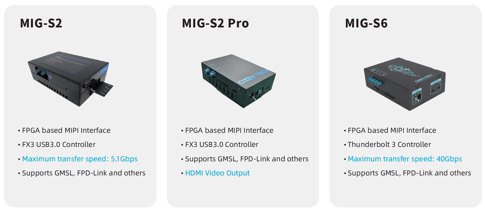

# Frame Grabber

**MIG Series Frame Grabber — MIG-S2 / MIG-S2 Pro / MIG-S6**

A compact, highly compatible MIPI-interface image capture card for automotive camera module systems. It supports GMSL / FPD-Link / Clockless Link / MIPI and is designed for AI/ADAS algorithm development after camera activation and for in-line camera image-quality testing.

[Download datasheet (PDF)](https://cizentech-my.sharepoint.com/:b:/p/mason/IQDrYS5vV8SoTZu11KLzHZ3TAbdqAmPb3fpWbN2JPVbDMoQ?e=T7eGuu)

>   Pairs with the [CameraMaster](CameraMaster.md) software for module bring-up, configuration, and live capture.

## 1. Overview

The MIG-S2 / MIG-S2 Pro is a compact, highly compatible, and reliable MIPI-interface image capture card designed for automotive camera module systems. With a streamlined design and ease of use, it supports image acquisition for most modules on the market. Its scalability and stable testing environment make it ideal for AI/ADAS algorithm development post-camera activation and for in-line camera image-quality testing.

-   **Activation Experience** — 500+ modules
-   **Broad System Compatibility** — Windows & Linux
-   **High-Speed Data Transfer** — USB 3.2 Gen 1 (5 Gbps), USB 3.2 Gen 2 (10 Gbps), Thunderbolt 3 (40 Gbps)
-   **Wide Power Range** — 1–20 V module power supply
-   **Deserializer Compatibility** — Supports ADI / TI / ROHM / SONY deserializer boards
-   **HDMI Display** — Full HD output (MIG-S2 Pro only)

## 2. Key Features

| \# | Feature                     | Description                                                                                                            |
|----|-----------------------------|------------------------------------------------------------------------------------------------------------------------|
| 01 | **Interface**               | For Windows 10 or higher. I2C camera control, link configuration, and sensor power sequencing.                         |
| 02 | **Ser/Des Support**         | Supports deserializers from many major global manufacturers.                                                           |
| 03 | **CameraMaster™ Software**  | Dedicated image-testing program providing operation and control for various cameras.                                   |
| 04 | **Compact Size**            | MIG-S2 offers a compact size with powerful performance, and basically includes a dual FAKRA deserializer (Maxim & TI). |
| 05 | **Development Environment** | Various SDKs to meet diverse developer needs — SDK for C/C++ and SDK for Python.                                       |

## 3. Models

### MIG-S2

-   FPGA-based MIPI interface
-   FX3 USB 3.0 controller
-   Maximum transfer speed: 5 Gbps
-   Supports GMSL, FPD-Link and other SerDes interfaces
-   MAX9296A deserializer board included, FPD-Link III selectable

### MIG-S2 Pro

-   FPGA-based MIPI interface
-   FX3 USB 3.0 controller
-   Supports GMSL, FPD-Link and other SerDes interfaces
-   MAX9296A deserializer board included, FPD-Link III selectable
-   Supports HDMI video output

### MIG-S6

-   FPGA-based MIPI interface
-   Thunderbolt 3 controller
-   Maximum transfer speed: 40 Gbps
-   Supports GMSL, FPD-Link and other SerDes interfaces
-   MAX9296A deserializer board included, FPD-Link III selectable

## 4. Specifications

| Item                       | MIG-S2                                                 | MIG-S2 Pro                                             | MIG-S6                                                  |
|----------------------------|--------------------------------------------------------|--------------------------------------------------------|---------------------------------------------------------|
| **Model Name**             | MIG-S2                                                 | MIG-S2 Pro                                             | MIG-S6                                                  |
| **Dimension**              | 146 × 100 × 50 (mm)                                    | 146 × 100 × 50 (mm)                                    | 170 × 118 × 42 (mm)                                     |
| **MIPI Interface**         | MIPI-CSI-2, 1/2/4-lane D-PHY rated at 2.5 Gbps/lane    | MIPI-CSI-2, 1/2/4-lane D-PHY rated at 2.5 Gbps/lane    | MIPI-CSI-2, 1/2/4-lane D-PHY rated at 2.5 Gbps/lane     |
| **Supported Video Format** | 8-bit to 16-bit RAW, YUV422, RGB888                    | 8-bit to 16-bit RAW, YUV422, RGB888                    | 8-bit to 16-bit RAW, YUV422, RGB888                     |
| **DPS**                    | 2CH, 1–20 V forcing voltage, 0–2 A current measurement | 2CH, 1–20 V forcing voltage, 0–2 A current measurement | 4CH, 1–20 V forcing voltage, 0–2 A current measurement  |
| **Supported Ser/Des**      | GMSL1, GMSL2/1, GMSL3/2, FPD-Link III                  | GMSL1, GMSL2/1, GMSL3/2, FPD-Link III                  | GMSL1, GMSL2/1, GMSL3/2, FPD-Link III                   |
| **Input Interface**        | 2× FAKRA connection                                    | 2× FAKRA connection                                    | 4× FAKRA connection                                     |
| **Output Interface**       | USB 3.0 Type-B connector (max. transfer speed 5 Gbps)  | USB 3.0 Type-B connector; HDMI video output 1080p@60Hz | Thunderbolt 3, C-Type (max. 40 Gbps, effective 22 Gbps) |
| **Power In**               | 12 V / 5 A DC adaptor                                  | 12 V / 5 A DC adaptor                                  | 12 V / 5 A DC adaptor                                   |

>   *All specifications are typical values and subject to change without notice.*

## 5. Development Environment

The MIG series provides various SDKs to meet diverse developer needs:

-   SDK for C/C++
-   SDK for Python

See the [MIG Grabber SDK](MIG_Grabber_SDK.md) page for API usage.

***

**CIZEN TECH Co., Ltd.**

624, 6F, 118 LS-ro 116beon-gil, Dongan-gu, Anyang-si, Gyeonggi-do, Republic of Korea

contact@cizentech.com

http://cizentech.com/
