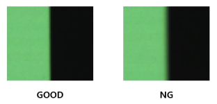
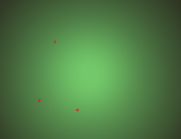
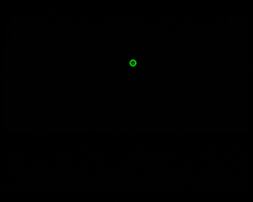
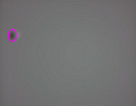
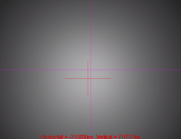
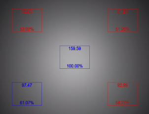
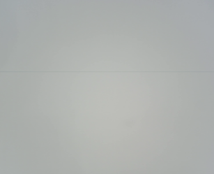
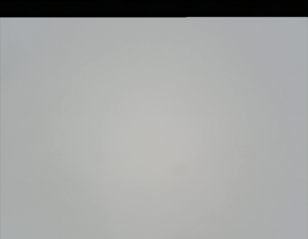

# Image Kit

## SFR

  

\- Tested according to ISO-12233:2023 standard

\- Measuring resolution with chart image including edges

## Distortion

\- Check the ratio of A and B using the SMIA standard inspection method

## Defect

 

\- This occurs when there is a defect in the sensor's pixels or foreign matter on the sensor surface.

\- Perform tests in bright or dark environments

## Stain (Blemish)

 

\- Defects due to foreign matter such as dust on the lens or between the lens and the image sensor

## Optical Center

\- Determine the location of the brightest area in the image and check how far it deviates from the center of the image.

## Shading (Vignetting)

\- Test is conducted by comparing the difference in brightness between the central and peripheral areas.

## Fixed Pattern Noise

 

\- This occurs because the pixel characteristics of the image sensor are not completely uniform.

\- Perform tests in bright or dark environments

## Uniformity

\- Check the uniformity of the image by measuring the standard deviation of the image.
