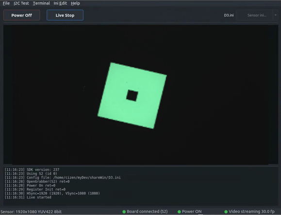
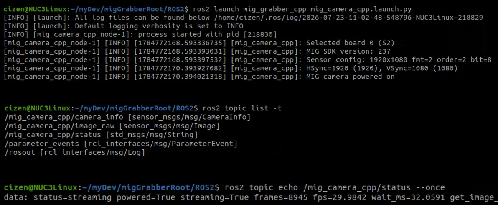

# Linux & ROS2

The MIG Grabber SDK also runs on Linux, and a ROS2 package is provided so that the grabber can publish captured frames directly into a ROS2 graph.

## Ubuntu 22.04 LTS

**The MIG Grabber SDK operates on Ubuntu 22.04 LTS with the MIG-S2 board, using the same `.ini` module configuration files as on Windows.**

Power on, register init, sync check, and live streaming work the same way as on Windows — the SDK reports the connected board, power state, and streaming frame rate.



```
[11:16:23] SDK version: 237
[11:16:23] Using S2 (id 0)
[11:16:23] Config file: /home/cizen/myDev/shareWin/D3.ini
[11:16:28] OpenGrabber(S2) ret=0
[11:16:28] Power On ret=0
[11:16:29] Register Init ret=0
[11:16:30] HSync=1920 (1920), VSync=1080 (1080)
[11:16:31] Live started
```

### Downloads

| File | Target | Description |
|---|---|---|
| [`cyusb_install.tar.xz`](https://cizentech-my.sharepoint.com/:u:/p/mason/IQCv68zCrrTlQaPhLg0TPDKHASwDQRTPKFQyDUHnjsGY8XU?e=wD54fL) | Ubuntu 20.04 / 22.04 | CyUSB Suite for Linux — the USB driver layer (`libcyusb`, udev rules) used to reach the grabber board |
| [`miglib_152_install_Ubuntu_20_.tar.xz`](https://cizentech-my.sharepoint.com/:u:/p/mason/IQD7F-dy3QADRqsaUYo2ZRt7AZeice-Ffwtay-20PLCXKAo?e=8UoSF9) | Ubuntu 20.04 LTS | MIG Grabber shared library `libmigGrabber.so.152` |
| [`miglib_152_install_Ubuntu_22_.tar.xz`](https://cizentech-my.sharepoint.com/:u:/p/mason/IQDOzx3KC6LrS4WwXi29N-ZWAavgR7De4b-5ZwBWsiztM0g?e=qsijzY) | Ubuntu 22.04 LTS | MIG Grabber shared library `libmigGrabber.so.152` |

Both archives extract flat, with no wrapper directory, so unpack each into its own folder.

### 1. Install the CyUSB driver

```bash
mkdir cyusb_install && tar xf cyusb_install.tar.xz -C cyusb_install
cd cyusb_install
sudo ./install.sh
```

`install.sh` must be run as root, from the directory it was extracted into — it resolves `configs/` and `lib/` relative to the current directory. It:

- writes `configs/88-cyusb.rules`, a udev rule matching the Cypress vendor ID `04b4` that sets the device node to mode `666` and calls `/usr/local/bin/cy_renumerate.sh` on device add (`A`) and remove (`R`)
- copies `configs/cyusb.conf` to `/etc/` and `88-cyusb.rules` to `/etc/udev/rules.d/`
- deletes stale `libcyusb.so*` from `/usr/lib` and `/usr/local/lib`
- installs `lib/libcyusb.so.1` into `/usr/local/lib` and symlinks `libcyusb.so` to it
- copies `cy_renumerate.sh` to `/usr/local/bin` with mode `777`

### 2. Install the MIG Grabber library

```bash
mkdir miglib_install && tar xf miglib_152_install_Ubuntu_22_.tar.xz -C miglib_install
cd miglib_install
sudo bash mig_install.sh
```

`mig_install.sh` carries no shebang and is not marked executable, so run it with `bash`. It:

- removes any existing `/usr/local/lib/libmigGrabber.so*`
- copies `libmigGrabber.so.152` into `/usr/local/lib`
- symlinks `/usr/local/lib/libmigGrabber.so` to `libmigGrabber.so.152`

On Ubuntu 20.04 LTS the steps are identical — use the `miglib_152_install_Ubuntu_20_` archive instead.

## ROS2

**The `mig_grabber_cpp` package brings the grabber up as a ROS2 node (`mig_camera_cpp`) and publishes the captured images as `sensor_msgs/msg/Image`.**

Launch the node:

```bash
ros2 launch mig_grabber_cpp mig_camera_cpp.launch.py
```



### Published topics

| Topic | Type | Description |
|---|---|---|
| `/mig_camera_cpp/image_raw` | `sensor_msgs/msg/Image` | Captured frames |
| `/mig_camera_cpp/camera_info` | `sensor_msgs/msg/CameraInfo` | Camera information |
| `/mig_camera_cpp/status` | `std_msgs/msg/String` | Board, power, and streaming status |

List the topics with their types:

```bash
ros2 topic list -t
```

Read the current status:

```bash
ros2 topic echo /mig_camera_cpp/status --once
```

```
data: status=streaming powered=True streaming=True frames=8945 fps=29.9842 wait_ms=32.0591
```
