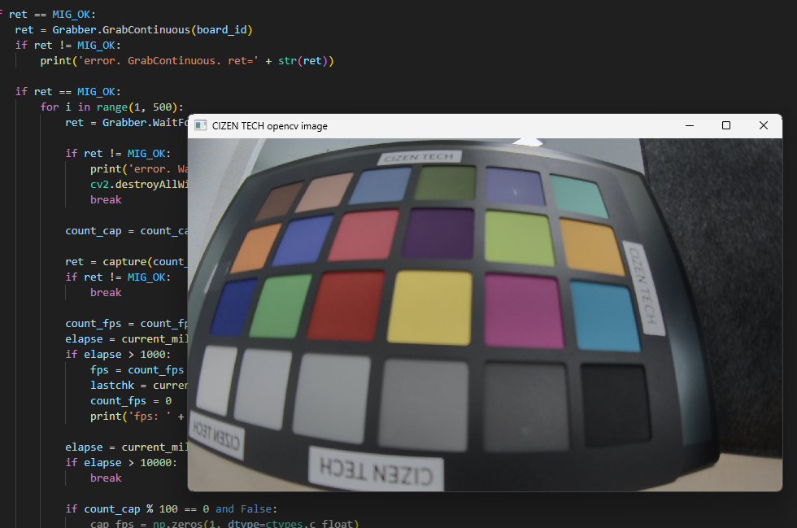

# MIG Grabber SDK

We provide a SDK (API) so that users can control the grabber through their own programs.

## API List

```
/**
 * @brief Get the version of MIG SDK.
 *
 * @return int
 */
extern int              GetMigSdkVersion();
/**
 * @brief Get the list of connected boards.
 *
 * @param pDest
 * @return #MIG_OK\n #MIG_ERR
 * @see _BOARD_LIST
 */
extern int              EnumerateBoard(_BOARD_LIST* pDest);
/**
 * @brief Get the number of connected boards.
 *
 * @return Gets the number of connected boards.
 */
extern int              GetNumOfBoard();
/**
 * @brief Get the board id by the usb index.
 *
 * @param nUsbIndex usb index
 * @return Board id : 0, 1, 2,, (-1: invalid usb index)
 */
extern int              GetBoardId(int nUsbIndex);
/**
 * @brief Get the error string.
 *
 * @param nErrCode error code
 * @param pBuff string buffer to get result
 * @param sizeBuff buffer size
 */
extern void             GetErrStr(int nErrCode, char* pBuff, int sizeBuff);
/**
 * @brief Set the parameter.
 *
 * @param BoardId ID to control
 * @param type #MIG_PARAM_VIDEO_FMT
 * @param val parameter value
 * @return #MIG_OK\n #MIG_ERR_INVALID_PARAMETER\n #MIG_ERR_GRABBER_NOT_OPENED
 */
extern int              SetParamInt(int BoardId, int type, int val);
/**
 * @brief Get the parameter.
 *
 * @param BoardId ID to control
 * @param type #MIG_PARAM_VIDEO_FMT
 * @return parameter value
 */
extern int              GetParamInt(int BoardId, int type);
/**
 * @brief Open Grabber board.
 *
 * @param BoardId ID to control
 * @param nGrabberType 1:S2
 * @param hwndParent handle of parent window (nullable)
 * @return #MIG_OK\n #MIG_ERR
 */
extern int              OpenGrabber(int BoardId, int nGrabberType, MIG_HANDLE hwndParent);
/**
 * @brief Set the config path name.
 *
 * @param BoardId ID to control
 * @param pConfigFilePath config path
 */
extern void             SetConfigPathName(int BoardId, const char* pConfigFilePath);
/**
 * @brief Close Grabber board.
 *
 * @param BoardId ID to control
 * @return #MIG_OK\n #MIG_ERR
 */
extern int              CloseGrabber(int BoardId);
/**
 * @brief Query that Grabber is opened.
 *
 * @param BoardId ID to control
 * @return TRUE. grabber is opened / FALSE
 */
extern BOOL             IsGrabberOpened(int BoardId);
/**
 * @brief Get the Grabber Type.
 *
 * @param BoardId ID to control
 * @return Grabber Type.
 */
extern int              GetGrabberType(int BoardId);
/**
 * @brief Get the Serial Number.
 *
 * @param BoardId ID to control
 * @param pSn string buffer to get SN
 * @param sizeSN buffer size
 * @return #MIG_OK\n #MIG_ERR\n #MIG_ERR_INTERFACE_NOT_IMPLEMENTED
 */
extern int              GetSerialNo(int BoardId, char* pSn, int sizeSN);
/**
 * @brief Query that Grabber is virtual mode.
 *
 * @param BoardId ID to control
 * @return TRUE. sdk is virtual mode / FALSE
 */
extern BOOL             IsVirtual(int BoardId);
/**
 * @brief Captures the specified number of frames.
 *
 * @param BoardId ID to control
 * @param nNbImage number of grab-image. normally that is 1. (over 1: average images)
 * @param dwTimeOut_ms command timeout (millisecond)
 * @return #MIG_OK\n #MIG_ERR_GRAB_IN_PROGRESS
 */
extern int              Grab(int BoardId, int nNbImage, DWORD dwTimeOut_ms);
/**
 * @brief Start capturing image.
 *
 * @param BoardId ID to control
 * @return #MIG_OK\n #MIG_ERR_GRAB_IN_PROGRESS
 * @see WaitForFrameDone()
 */
extern int              GrabContinuous(int BoardId);
/**
 * @brief Query that Grab is in progress.
 *
 * @param BoardId ID to control
 * @return BOOL
 */
extern BOOL             GrabInProgress(int BoardId);
/**
 * @brief Stop capturing image.
 *
 * @param BoardId ID to control
 * @return #MIG_OK\n #MIG_ERR
 */
extern int              HaltGrab(int BoardId);
/**
 * @brief Wait for new frame.
 *
 * @param BoardId ID to control
 * @param dwTimeOut_ms timeout for waiting new frame (millisecond)
 * @return #MIG_OK\n #MIG_ERR_GRAB_TIMEOUT
 * @see GrabContinuous()
 */
extern int              WaitForFrameDone(int BoardId, DWORD dwTimeOut_ms);
/**
 * @brief Get image data.
 *
 * @param BoardId ID to control
 * @param pDstBuffer Destination buffer to get image data
 * @param dstWidth image width
 * @param dstHeight image height
 * @param dstPitchBytes pitch bytes
 * @return #MIG_OK\n #MIG_ERR
 */
extern int              GetImage(int BoardId, unsigned char* pDstBuffer, int dstWidth, int dstHeight, int dstPitchBytes);
/**
 * @brief Read i2c data.
 *
 * @param BoardId ID to control
 * @param wRegAddr Register address
 * @param pbytValue Register read buffer
 * @param nLength read length
 * @return #MIG_OK\n #MIG_ERR
 */
extern int              i2cRead(int BoardId, unsigned short wRegAddr, BYTE* pbytValue, int nLength);
/**
 * @brief Write i2c data.
 *
 * @param BoardId ID to control
 * @param wRegAddr Register address
 * @param pbytValue Register data
 * @param nLength data length
 * @return MIG_OK
 * @see MIG_ERR_I2C_NO_ACK_DEV_ADDR
 */
extern int              i2cWrite(int BoardId, unsigned short wRegAddr, BYTE* pbytValue, int nLength);
/**
 * @brief Reset bulk i2c buffer data.
 *
 * @param BoardId ID to control
 * @return #MIG_OK\n #MIG_ERR
 */
extern int              bulk_i2cReset(int BoardId);
/**
 * @brief Add i2c data into bulk buffer.
 *
 * @param BoardId ID to control
 * @param wRegAddr Register address
 * @param pbytValue Register data
 * @param nLength data length
 * @return #MIG_OK\n #MIG_ERR
 */
extern int              bulk_i2cSet(int BoardId, unsigned short wRegAddr, BYTE* pbytValue, int nLength);
/**
 * @brief Add delay data into bulk buffer.
 *
 * @param BoardId ID to control
 * @param wDelay_ms
 * @return #MIG_OK\n #MIG_ERR
 */
extern int              bulk_i2cSetDelay(int BoardId, WORD wDelay_ms);
/**
 * @brief Execute bulk i2c buffer data.
 *
 * @param BoardId ID to control
 * @return #MIG_OK\n #MIG_ERR
 */
extern int              bulk_i2cRun(int BoardId);
/**
 * @brief Power on the specified power channel.
 *
 * @param BoardId ID to control
 * @param nPwrChannel power channel 0, 1, 2,,,
 * @param nPwrLevel_mV power level (mili voltage)
 * @return #MIG_OK\n #MIG_ERR
 */
extern int              pwrSetVoltage(int BoardId, int nPwrChannel, const int nPwrLevel_mV);
/**
 * @brief Measure voltage on specified power channel.
 *
 * @param BoardId ID to control
 * @param nPwrChannel power channel 0, 1, 2,,,
 * @param pPwrResult_mV
 * @return #MIG_OK\n #MIG_ERR
 */
extern int              pwrMeasureVoltage(int BoardId, int nPwrChannel, int* pPwrResult_mV);
/**
 * @brief Measure current on specified power channel.
 *
 * @param BoardId ID to control
 * @param nPwrChannel power channel 0, 1, 2,,,
 * @param pPwrResult_mA
 * @return #MIG_OK\n #MIG_ERR
 */
extern int              pwrMeasureCurrent(int BoardId, int nPwrChannel, int* pPwrResult_mA);
/**
 * @brief Apply power or Sensor init configuration.  ex> [POWERON] [REGISTER_INIT]
 *
 * @param BoardId ID to control
 * @param pFile file name of sensor init
 * @param pSection section name of sensor init
 * @param pnErrorIndex if error, error line number
 * @return #MIG_OK\n #MIG_ERR_EMPTY_REGISTER_SET\n #MIG_ERR_I2C_NO_ACK_DEV_ADDR\n #MIG_ERR_INVALID_COMMAND
 */
extern int              WriteRegisterSet(int BoardId, const char* pFile, const char* pSection, int* pnErrorIndex);
/**
 * @brief Read sync count to check module output.
 *
 * @param BoardId ID to control
 * @param dwTimeOut_ms timeout for waiting valid sync
 * @param pDestHsync count of Horizontal sync
 * @param pDestVsync count of Vertical sync
 * @param pDestPClk_Hz count of PCLK
 * @return #MIG_OK\n #MIG_ERR_TIMEOUT_READSYNC
 */
extern int              ReadSyncCount(int BoardId, DWORD dwTimeOut_ms, int* pDestHsync, int* pDestVsync, ULONG* pDestPClk_Hz);
```

## C++ Sample code

```
// Dynamically Load API from SDK library
sFile.Format(_T("%s\\migGrabber.dll"), Helper::GetCurrentProcessPath());

HMODULE hSdk = LoadLibrary(sFile);
if (hSdk)
{
	SetParamInt = (_SetParamInt)GetProcAddress(hSdk, "SetParamInt");
	GetParamInt = (_GetParamInt)GetProcAddress(hSdk, "GetParamInt");
	SetParamDouble = (_SetParamDouble)GetProcAddress(hSdk, "SetParamDouble");
	GetParamDouble = (_GetParamDouble)GetProcAddress(hSdk, "GetParamDouble");

	GetNumOfBoard = (_GetNumOfBoard)GetProcAddress(hSdk, "GetNumOfBoard");
	GetBoardId = (_GetBoardId)GetProcAddress(hSdk, "GetBoardId");

	EnumerateBoard = (_EnumerateBoard)GetProcAddress(hSdk, "EnumerateBoard");

	OpenGrabber = (_OpenGrabber)GetProcAddress(hSdk, "OpenGrabber");
}

// Open Grabber System
nRet = OpenGrabber(nBoardID, MIG_GRABBER_S1, NULL);

// Setup Grabber board with Test Image config
nRet = SetParamInt(nBoardID, MIG_PARAM_VIDEO_FMT, video_format);
nRet = SetParamInt(nBoardID, MIG_PARAM_PIXEL_ORDER, pxl_order);
nRet = SetParamInt(nBoardID, MIG_PARAM_HOR_RES, width);
nRet = SetParamInt(nBoardID, MIG_PARAM_VER_RES, height);
nRet = SetParamInt(nBoardID, MIG_PARAM_BITS_PER_PIXEL, bitPerPxl);

// Send sensor power on config set
// [POWERON]
// PWR 1 8
// PWR 2 8
// DELAY 300

sFile.Format(_T("%s\\Test.ini"), Helper::GetCurrentProcessPath());
nRet = WriteRegisterSet(nBoardID, sFile, "POWERON", &nErrIndex);

// Send sensor initial config set
// [REGISTER_INIT]
// BOARD_PRESET RESET
// adddevadr x90 400 1 0 / Des
// adddevadr x80 400 1 0 / Ser
// adddevadr x36 400 1 0 / Sensor
// devadr x90
// x0010 x81 /reset_all
// DELAY 150
// x0001 x02 /RX_RATE[1:0] def:x01(3Gbps) x02(6Gbps)
// x0313 x00 /CSI out Disable

sFile.Format(_T("%s\\Test.ini"), Helper::GetCurrentProcessPath());
nRet = WriteRegisterSet(nBoardID, sFile, "REGISTER_INIT", &nErrIndex);

// Read Image Data Sync Count (to check image data validation)
nRet = ReadSyncCount(nBoardID, dwTimeout, &nSyncH, &nSyncV, &ulPClk_Hz);

// Capture Image in Grabber and copy image data from Grabber board to application.
nRet = Grab(nBoardID, 1, 1000);
if (nRet == MIG_OK)
{
	nRet = GetImage(nBoardID, m_vBuff[0], m_nWidth, m_nHeight, m_nLineBytes);
}

// i2c write and read function
nRet = i2cWrite(nBoardID, reg, data, nLen);
nRet = i2cRead(nBoardID, reg, data, nLen);
```

## Python Sample code



```
# Load SDK Library
pathname = os.path.dirname(sys.argv[0])
sdk_file = pathname + '\migGrabber'
Grabber = ctypes.WinDLL(sdk_file)

# Setup Grabber board with Test Image config
ret = Grabber.SetParamInt(board_id, MIG_PARAM_VIDEO_FMT, video_format)
ret = Grabber.SetParamInt(board_id, MIG_PARAM_PIXEL_ORDER, pixel_order)
ret = Grabber.SetParamInt(board_id, MIG_PARAM_HOR_RES, width)
ret = Grabber.SetParamInt(board_id, MIG_PARAM_VER_RES, height)

# Send sensor power on config set
poweron_section = 'POWERON'
ret = Grabber.WriteRegisterSet(board_id, file_config.encode('utf-8'), poweron_section.encode('utf-8'), 0)

# Send sensor initial config set
init_section = 'REGISTER_INIT'
ret = Grabber.WriteRegisterSet(board_id, file_config.encode('utf-8'), init_section.encode('utf-8'), 0)

# Read Image Data Sync Count (to check image data validation)
ret = Grabber.ReadSyncCount(board_id,1000, pHsync, pVsync, 0)

# Capture Image in Grabber and copy image data from Grabber board to application.
ret = Grabber.Grab(board_id, 1, 1000)
if (ret == 0)
{
	ret = Grabber.GetImage(board_id, pBuff, width, height, width * bytePexPxl)
}
```
