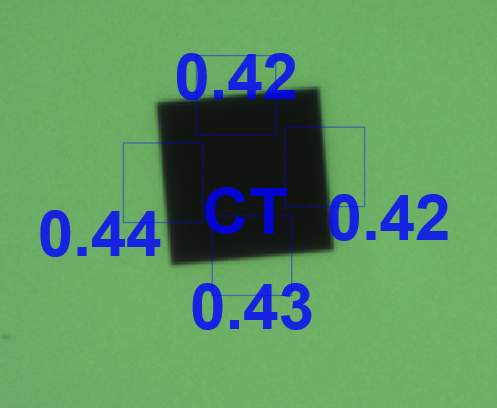
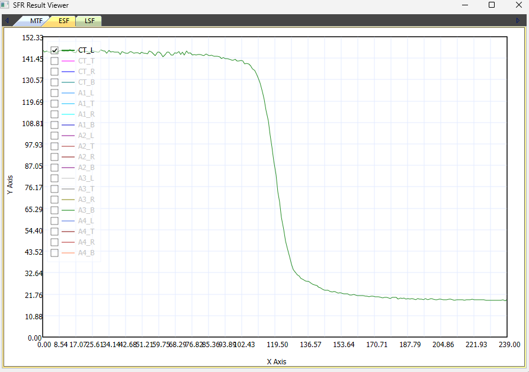
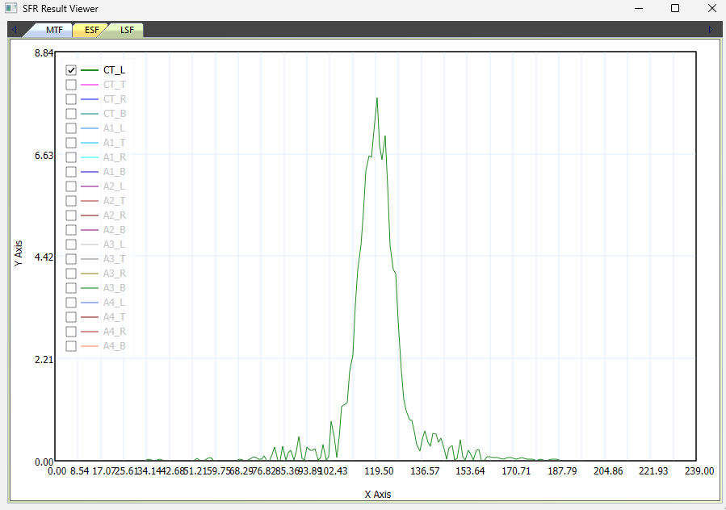
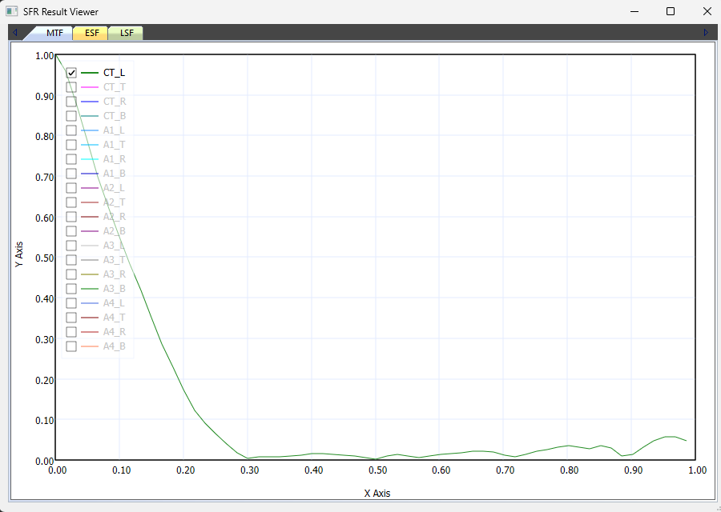
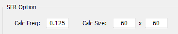

# SFR Method

**SFR (Spatial Frequency Response)** 는 카메라가 공간 주파수에 따라 명암 대비(contrast)를 얼마나 유지하는지로 해상력을 평가하는 측정 방법입니다. CameraMaster 는 차트의 엣지(edge)를 검출한 뒤 **ESF → LSF → MTF** 순으로 변환하여 SFR 값을 산출합니다.

> ISO-12233 표준의 Slanted-Edge 방식을 기반으로 합니다.

## 측정 흐름

| 단계 | 내용 | 산출물 |
| --- | --- | --- |
| 1 | SFR 블럭 / 엣지 검출 및 이미지 획득 | 엣지 영역 이미지 |
| 2 | ESF (Edge Spread Function) 데이터 획득 | 밝기 분포 곡선 |
| 3 | LSF (Line Spread Function) 데이터 획득 | 밝기 변화량(미분) 곡선 |
| 4 | MTF 값 확인 | 주파수별 선명도 |
| 5 | cycles/pixel → cycles/mm 변환 | LP/mm, MTF50 해석 |

---

## 1. SFR 블럭 / 엣지 검출



\- SFR 블럭을 찾고 각 엣지를 찾음

\- SFR 블럭 찾기 → 해당 블럭의 상하좌우 각 에지 찾기

\- Bayer 영상의 경우 디모자익(demosaic) 진행

\- 영상에서 Y(휘도) 값을 추출하여 SFR 계산을 위한 이미지 획득

## 2. ESF (Edge Spread Function) 데이터 획득



\- 에지를 중심으로 한 밝기 그래프 (X축 : 픽셀 위치, Y축 : 픽셀 밝기)

1. 각 라인의 엣지 위치를 찾음
2. 엣지를 기준으로 좌표 재정렬
3. 에지 중심으로 좌우 같은 거리의 밝기값 평균
4. ESF 생성

## 3. LSF (Line Spread Function) 데이터 획득



\- ESF 의 기울기(변화량 = 미분) 그래프 (X축 : 픽셀 위치, Y축 : 에지 기울기)

\- 경계선에서 위치(값)가 높음

\- 뾰족하게 생기면 포커스가 높음

\- 펑퍼짐하고 낮으면 포커스가 낮음

## 4. MTF 값 확인

 

\- LSF 를 FFT(푸리에 변환)한 후 주파수별로 이미지 선명도를 확인 (X축 : 공간 주파수 cycles/pixel, Y축 : MTF 값 = SFR)

\- 주파수가 `0.125 (cycle/pixel)` 위치의 MTF 값은 `0.44` 로 확인됨

## 5. cycles/pixel → cycles/mm 변환

mm 당 라인 페어(Line Pair) 갯수로 변환합니다.

```
cycles/mm = (cycles/pixel) / Pixel pitch (mm/pixel)
```

\- MTF50 은 MTF 값 `0.5` 에서의 Line Pair 갯수

**예시** — Pixel pitch 1.4 um 인 경우

```
1.4 um  →  0.0014 mm
0.11 / 0.0014 = 71.42 LP/mm  (cycles/mm)
```

### Y축(MTF 값)의 의미

\- 흑백 대비를 몇 % 유지했는가를 의미

\- 실제 차트가 검정 `=0`, 흰색 `=255` 일 경우, MTF50 에서는 검정 `≈64` / 흰색 `≈191` 정도로 보임

\- 즉 `71.42 LP/mm` 수준까지는 원래 대비의 절반을 유지하며, 71 개 라인은 선명하게 구분됨

### MTF 판정 기준

| 기준 | 의미 |
| --- | --- |
| **MTF50** | 선명하게 보임 |
| **MTF30** | 어느 정도 보임 |
| **MTF10** | 분해 가능 한계 |
